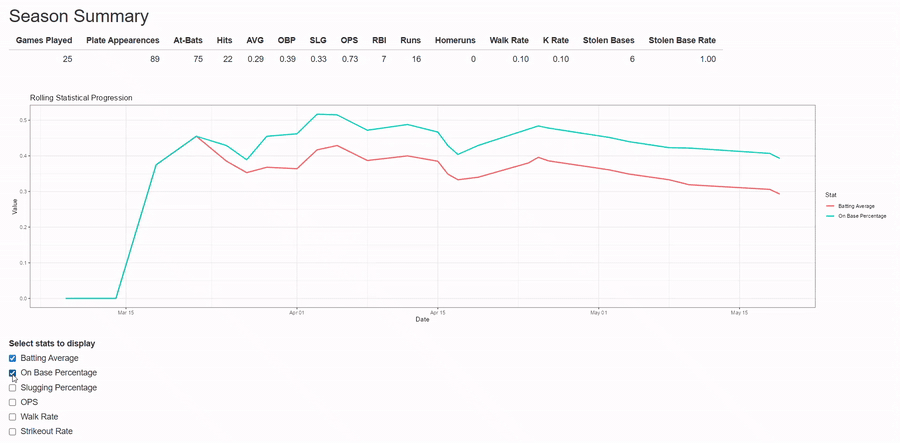

# HitPlotR

HitPlotR is an R package for transforming game-by-game baseball data into season statistics and interactive performance visualizations.

The package was designed to make season-long baseball analytics accessible using statistics that can be collected from a traditional scorebook. HitPlotR calculates common offensive metrics, tracks how those metrics develop throughout a season, and brings the results together in an interactive Shiny application.

## Features

- Calculates season totals and offensive statistics
- Tracks cumulative statistics game by game
- Visualizes changes in player performance throughout a season
- Standardizes common variations in baseball statistic column names
- Generates interactive results through a Shiny application
- Includes sample player data for immediate testing

## Installation

Install HitPlotR directly from GitHub:

```r
install.packages("remotes")
remotes::install_github("elstonmiller/hitplotr")
```

Then load the package:

```r
library(hitplotr)
```

## Quick Start

HitPlotR includes `playerSample`, a game-by-game dataset containing my actual statistics from my junior year of high school baseball.

Launch the application with:

```r
plotHits(playerSample)
```

`plotHits()` processes the game data, calculates season statistics and cumulative metrics, and launches the interactive Shiny application.

## Statistics

HitPlotR calculates and visualizes offensive statistics including:

- Batting Average (AVG)
- On-Base Percentage (OBP)
- Slugging Percentage (SLG)
- On-Base Plus Slugging (OPS)
- Strikeout Rate (K%)
- Walk Rate (BB%)
- Stolen Base Percentage (SB%)

## Package Workflow

```text
Game-by-game data
        ↓
Column standardization
        ↓
Season totals & derived statistics
        ↓
Cumulative game-by-game statistics
        ↓
Visualization
        ↓
Interactive Shiny application
```
## Demo



## Documentation

HitPlotR includes documentation for its functions and included datasets. After installing the package, documentation can be accessed directly through R:

```r
?plotHits
?playerSample
```

Additional function documentation is available through R's standard help system.

## Technologies

HitPlotR was built using:

- R
- Shiny
- ggplot2
- dplyr
- tidyr

## Author

Developed by **Elston Miller**.

For a visual overview of the project, including a demonstration of the Shiny application, visit the HitPlotR project on my portfolio.
